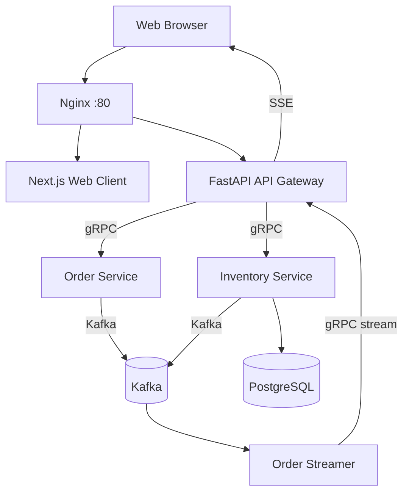

# Order Processing System (gRPC Microservices)

A production-style, event-driven order platform built with gRPC, FastAPI, Go, Kafka, and a Next.js dashboard. It demonstrates REST-to-gRPC bridging, inventory reservation with ACID guarantees, and real-time order status updates via Kafka + gRPC streaming + SSE.

## Highlights
- **API Gateway (FastAPI)** exposes REST endpoints and bridges to gRPC services.
- **Order Service (Go)** persists orders and publishes events to Kafka.
- **Inventory Service (FastAPI + SQLAlchemy)** provides atomic stock reservations backed by PostgreSQL (Neon-ready).
- **Order Streamer (Go)** consumes Kafka events and exposes a gRPC server-streaming API.
- **Web Client (Next.js)** consumes REST + SSE to display live order updates.
- **Nginx Proxy** routes `/` to the UI and `/api` to the gateway.

## Architecture (At a Glance)



## Event Flow
1. **Create order** via REST (`POST /api/orders`).
2. **Order Service** stores the order and emits `order.created` to Kafka.
3. **Inventory Service** consumes the event, reserves stock atomically, then publishes `inventory.reserved` or `inventory.failed`.
4. **Order Service** consumes inventory results, updates order status, and emits `order.updated`.
5. **Order Streamer** publishes updates to gRPC stream.
6. **API Gateway** bridges gRPC stream to **SSE** at `/api/orders/events` for the web client.

## Services and Ports
- **proxy (nginx)**: `http://localhost` (routes `/` and `/api`)
- **api-gateway**: internal `:8000` (FastAPI REST + SSE)
- **order-service**: internal `:50051` (gRPC)
- **inventory-service**: internal `:50052` (gRPC + REST health)
- **order-streamer**: internal `:50053` (gRPC streaming)
- **kafka**: `localhost:9094` (external), `kafka:29092` (internal)
- **postgres**: via `DATABASE_URL` (Neon or local)

## REST API (via API Gateway)
Base URL: `http://localhost/api`

- `GET /` -> gateway health response
- `POST /orders` -> create order
- `GET /orders` -> list orders (`customer_id` optional)
- `GET /orders/{order_id}` -> fetch order
- `GET /orders/events` -> SSE stream of live updates
- `GET /inventory` -> gateway inventory check (placeholder)

Example (create order):
```bash
curl -X POST http://localhost/api/orders \
  -H "Content-Type: application/json" \
  -d '{"customer_id":"CUST-001","items":[{"product_id":"PROD-001","quantity":1,"price":100.0}]}'
```

## Quick Start (Docker)
```bash
# from repo root
cd order-processing-system

# build and start everything
make up
```

Open:
- UI: `http://localhost`
- API: `http://localhost/api`
- SSE: `http://localhost/api/orders/events`

## Development Mode (Hot Reload)
```bash
make up-dev
```

## Local Development (without Docker)
### Prerequisites
- Python 3.10+
- Go 1.20+
- `protoc` + Go plugins

### Generate gRPC Code
```bash
make generate
```

### Run Services
```bash
# API Gateway
cd api-gateway
uv venv && source .venv/bin/activate
uv pip install -e .
uvicorn src.app.main:app --reload

# Inventory Service
cd ../inventory-service
uv venv && source .venv/bin/activate
uv pip install -e .
uvicorn src.app.main:app --reload

# Order Service
cd ../order-service
go mod tidy
go run cmd/server/main.go

# Order Streamer
cd ../order-streamer
go mod tidy
go run cmd/server/main.go
```

## Configuration
Copy `.env.example` to `.env` and set credentials.

Key environment variables:
- `DATABASE_URL` (Inventory DB, asyncpg)
- `ORDER_SERVICE_ADDR` (gateway -> order gRPC)
- `INVENTORY_SERVICE_ADDR` (gateway -> inventory gRPC)
- `STREAM_SERVICE_ADDR` (gateway -> order-streamer gRPC)
- `KAFKA_BROKERS` (Kafka bootstrap, e.g. `kafka:29092`)
- `ORDER_DATABASE_URL` (order-service DB in dev compose)

## Repo Map
```text
order-processing-system/
  api-gateway/        FastAPI REST + gRPC clients
  inventory-service/  FastAPI + gRPC server + PostgreSQL
  order-service/      Go gRPC server + Kafka producer/consumer
  order-streamer/     Go gRPC stream server (Kafka -> gRPC)
  web-client/         Next.js dashboard (REST + SSE)
  proto/              Protobuf definitions
  proxy/              Nginx reverse proxy config
  docs/               Architecture and setup guides
```

## Docs
- `docs/architecture.md`
- `docs/architecture_diagram.md`
- `docs/setup.md`
- `docs/frontend_integration.md`
- `docs/postgresql_config.md`
- `docs/neon_setup.md`

## Makefile
- `make generate` -> gRPC code generation for Python/Go
- `make up` -> Docker Compose (prod-style)
- `make up-dev` -> Docker Compose with hot reload
- `make down` -> stop services
