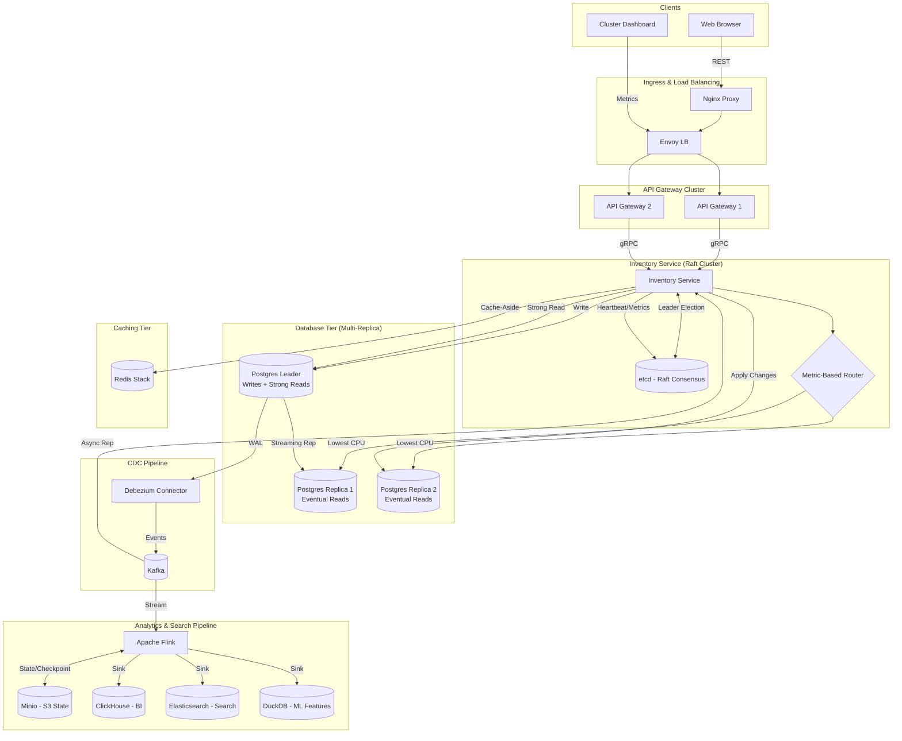

# Order Processing System (gRPC Microservices)

A production-style, event-driven order platform built with gRPC, FastAPI, Go, Kafka, and a Next.js dashboard. It demonstrates REST-to-gRPC bridging, inventory reservation with ACID guarantees, and real-time order status updates via Kafka + gRPC streaming + SSE.

## Highlights
- **Multi-Replica Raft Cluster**: Distributed leader election and state management using `etcd`.
- **Metric-Based Read Routing**: Intelligent routing based on real-time CPU and connection metrics.
- **Hybrid CDC Replication**: Postgres streaming + Kafka-based async CDC.
- **API Gateways (FastAPI)**: Distributed cluster (Multi-replica) for high availability and horizontal scaling.
- **Rate Limiting**: Distributed Token Bucket using Redis.
- **Load Shedding**: Graceful degradation under stress.
- **Envoy Ingress Resilience**: Advanced circuit breaking, outlier detection, and retry budgets at the edge.
- **Tier-1 Bloom Filter** for catalog existence pre-filtering.
- **Order Service (Go)** persists orders and publishes events to Kafka.
- **Inventory Service (FastAPI + SQLAlchemy)** provides atomic stock reservations backed by PostgreSQL, now with a **Tier-2 Cuckoo Filter** for fast in-stock checks and a **high-performance Redis Cache (Cache-Aside)** with request coalescing and jitter.
- **Redis Stack** provides the backbone for the Bloom filters, Cuckoo filters, and the caching layer.
- **Order Streamer (Go)** consumes Kafka events and exposes a gRPC server-streaming API.
- **Web Client (Next.js)** consumes REST + SSE to display live order updates.
- **Nginx Proxy** routes `/` to the UI and `/api` to the gateway.- **Rate Limiting**: Distributed Token Bucket using Redis.
- **Load Shedding**: Graceful degradation under stress.
- **Tier-1 Bloom Filter** for catalog existence pre-filtering.
- **Order Service (Go)** persists orders and publishes events to Kafka.
- **Inventory Service (FastAPI + SQLAlchemy)** provides atomic stock reservations backed by PostgreSQL, now with a **Tier-2 Cuckoo Filter** for fast in-stock checks and a **high-performance Redis Cache (Cache-Aside)** with request coalescing and jitter.
- **Redis Stack** provides the backbone for the Bloom filters, Cuckoo filters, and the caching layer.
- **Order Streamer (Go)** consumes Kafka events and exposes a gRPC server-streaming API.
- **Web Client (Next.js)** consumes REST + SSE to display live order updates.
- **Nginx Proxy** routes `/` to the UI and `/api` to the gateway.
- **Envoy Proxy**: High-performance L7 load balancer for gRPC and HTTP/2 traffic distribution using Least Connection + Consistent Hashing.
- **Nginx Proxy**: Edge ingress routing for frontend and API traffic.
- **Full Observability**: OpenTelemetry, Jaeger, Prometheus, Loki, and Grafana.
- **Analytics Pipeline (Apache Flink)**: Real-time stream processing with **Exactly-Once Semantics**, **RocksDB StateBackend**, and **S3/Minio Checkpointing**.
- **Columnar Analytics (ClickHouse)**: High-performance OLAP storage for BI dashboards and aggregation.
- **Search Engine (Elasticsearch)**: Real-time search indexing for orders and products, with a resilient Cloud/Local fallback architecture.
- **Elasticvue**: Integrated UI for real-time Elasticsearch exploration and cluster management.
- **ML Feature Store (DuckDB + Feast)**: Localized feature extraction and persistence for ML training and inference.
- **Resilience Strategy (DLQ & Replay)**: Implementation of Dead Letter Queues with exponential backoff and idempotent replay for all core services.
- **Admin Visibility**: Kafka UI, **Flink UI**, **Elasticvue**, **DLQ Monitor**, **RedisInsight**, and **Redis Commander**.
- **Advanced Caching**: Redis-based **Event-Driven Invalidation** and **Asynchronous Warming**.
## Architecture (Raft Cluster + Multi-Replica CDC)



## Event Flow
1. **Create order** via REST (`POST /api/orders`).
2. **Order Service** stores the order and emits `order.created` to Kafka.
3. **Inventory Service** consumes the event, checks the Bloom filter and Redis cache, then reserves stock atomically in DB if needed. It then updates the cache and publishes `inventory.reserved` or `inventory.failed`.
4. **Order Service** consumes inventory results, updates order status, and emits `order.updated`.
5. **Order Streamer** publishes updates to gRPC stream.
6. **API Gateway** bridges gRPC stream to **SSE** at `/api/orders/events` for the web client.

## Database Orchestration & CDC
The system features a sophisticated database architecture designed for scaling and real-time data consistency.

- **Leader-Replica Orchestration**: The `inventory-service` dynamically routes writes and strong-consistency reads to the PostgreSQL Leader, while eventual-consistency reads (like catalog listings) are routed to a Read Replica.
- **Change Data Capture (CDC)**: Powered by **Debezium**, the system captures row-level changes from the PostgreSQL Write-Ahead Log (WAL) and streams them into Kafka topics (`inventory_cdc.public.inventory`).
- **Read/Write Splitting**: Managed via dual SQLAlchemy engines (`writer_engine` and `reader_engine`) in the `inventory-service`.

## Real-time Analytics Pipeline
The system incorporates a robust analytics pipeline that processes order events in real-time to drive BI, search, and ML features.

- **Stream Processing**: Apache Flink consumes `order.events` from Kafka, performingExactly-Once aggregations and transformations.
- **Multi-Sink Architecture**:
    - **ClickHouse**: Optimized for BI dashboards and fast analytical queries.
    - **Elasticsearch**: Powering sub-second order search and discovery.
    - **DuckDB**: Serving as a local feature store for ML model inference.
- **Monitoring**: Use **Flink UI** (`:8081`) to monitor job health and **Elasticvue** (`:8084`) to explore search indices.

## Setup Guide: Enabling CDC (Neon Postgres)

To get the full Leader-Replica + CDC flow running with Neon:

1. **Enable Logical Replication**:
   - Go to your **Neon Console**.
   - Navigate to **Settings** -> **Database Configuration**.
   - Set `wal_level` to `logical`. (Note: This is required for Debezium to read the WAL).

2. **Configure Environment**:
   Ensure your `.env` file has both the leader and replica strings:

   ```env
   DATABASE_URL=postgresql+asyncpg://... (Leader)
   REPLICA_DATABASE_URL=postgresql+asyncpg://... (Replica)
   ```

3. **Start the Infrastructure**:

   ```bash
   make up-dev
   ```

4. **Register the CDC Connector**:
   Run the following command to POST the connector configuration to the Debezium service:

   ```bash
   make cdc-setup
   ```

5. **Verify**:
   Open the **Kafka UI** (`http://localhost:8080`) to see the CDC events flowing into the `inventory_cdc` topics.

## Services and Ports

- **proxy (nginx)**: `http://localhost` (Edge ingress)
- **envoy**: `http://localhost:8085` (Internal LB), Admin: `:9901`
- **api-gateway-1**: internal `:8000` (Replica 1)
- **api-gateway-2**: internal `:8000` (Replica 2)
- **order-service**: internal `:50051` (gRPC)
- **inventory-service**: internal `:50052` (gRPC + REST health)
- **order-streamer**: internal `:50053` (gRPC streaming)
- **kafka**: `localhost:9094` (external), `kafka:29092` (internal)
- **postgres**: via `DATABASE_URL` (Neon or local)

## REST API (via API Gateway)
Base URL: `http://localhost/api`

- `GET /health` -> advanced gateway health (checks all dependencies)
- `POST /orders` -> create order
- `GET /orders` -> list orders (`customer_id` optional)
- `GET /orders/{order_id}` -> fetch order
- `GET /orders/events` -> SSE stream of live updates
- `GET /inventory` -> gateway inventory check (placeholder)

### Health Check Endpoints (Direct)
- `GET /api/auth/health` -> Auth Service (DB check)
- `GET /api/inventory/health` -> Inventory Service (DB & Redis check)
- `GET /api/orders/health` -> Order Service (DB check)
- `GET /api/streamer/health` -> Order Streamer (Kafka check)
- `GET /api/health` -> API Gateway (Dependency health summary)

Example (create order):
```bash
curl -X POST http://localhost/api/orders \
  -H "Content-Type: application/json" \
  -d '{"customer_id":"CUST-001","items":[{"product_id":"PROD-001","quantity":1,"price":100.0}]}'
```

## Resilience Strategy (DLQ & Replay)

The system implements a robust recovery mechanism for failed events using Dead Letter Queues and an Idempotent Replay strategy.

- **Exponential Backoff**: Services retry failed Kafka processing with increasing delays (max 3 retries).
- **Dead Letter Queues (DLQ)**: Events that fail all retries are published to specific DLQ topics (`service.dlq`) with full error metadata.
- **Idempotency**: All consumers implement idempotency (DB-backed for inventory, in-memory for streamer) to safely handle replayed events.
- **Replay Mechanism**: A dedicated `replay-service` can republish events from DLQ topics back to the main processing path.
- **DLQ Monitor**: A visual dashboard to inspect trapped events and errors.

## Observability & Monitoring

The system is equipped with a full observability stack:
- **Jaeger**: Distributed tracing (`make jaeger`)
- **Grafana**: Dashboards & Loki Logs (`make grafana`)
- **Prometheus**: Metrics (`make prometheus`)
- **Kafka UI**: Topic/Message monitoring (`make kafka-ui`)

For setup details, see [Observability Documentation](docs/observability.md).

## Advanced Caching & Invalidation
The system utilizes a high-performance caching layer in the `inventory-service` to minimize database latency and prevent meltdowns during traffic spikes.

- **Cache-Aside Strategy**: Stock levels are served from Redis, falling back to PostgreSQL only on misses.
- **Event-Driven Invalidation**: The "Golden Rule" is followed—cache is refreshed via `inventory.updated` Kafka events, ensuring all service instances stay synchronized.
- **Resilience Patterns**:
    - **Single-flight**: Coalesces concurrent requests for the same item into one DB hit.
    - **TTL Jitter**: Staggers cache expirations (0-5 min jitter) to prevent thundering herds.
- **Asynchronous Warming**: Background tasks populate the cache on startup without blocking the service.

## Management & Monitoring Tools

| Tool | Access URL | Description |
| :--- | :--- | :--- |
| **Grafana** | `http://localhost:3000` | Unified dashboards for metrics, logs, and cache performance. |
| **Jaeger** | `http://localhost:16686` | Distributed tracing for gRPC and HTTP requests. |
| **Elasticvue** | `http://localhost:8084` | Native Elasticsearch UI for browsing indices and cluster health. |
| **Flink UI** | `http://localhost:8081` | Real-time monitoring of stream processing jobs. |
| **Kafka UI** | `http://localhost:8080` | Monitor topics and `inventory.updated` events. |
| **RedisInsight** | `http://localhost:8003` | Native Redis UI for memory analysis and profiling. |
| **Redis Commander** | `http://localhost:8081` | Web-based Redis key management. |
| **DLQ Monitor** | `http://localhost:8086` | View events in Dead Letter Queues. |
| **Envoy Admin** | `http://localhost:9901` | Traffic distribution metrics & cluster health. |
| **Prometheus** | `http://localhost:9090` | Raw metrics and service target status. |

## Full Tech Flow (How to Run)

To run the entire stack and see the system in action:

1. **Clean and Generate**:
   ```bash
   make clean generate
   ```
2. **Launch Stack**:
   ```bash
   make up-dev
   ```
3. **Seed Data**: (Generate activity for monitoring)
   ```bash
   make seed
   ```
4. **Observe**:
   Open monitoring tools using `make jaeger`, `make grafana`, or `make kafka-ui`.

## Quick Start (Docker)
```bash
# from repo root
cd order-processing-system

# build and start everything
make up
```

Open:
- UI: `http://localhost`
- API: `http://localhost/api`
- SSE: `http://localhost/api/orders/events`

## Development Mode (Hot Reload)
Standard hot-reload via volumes:
```bash
make up-dev
```

### Docker Compose Watch (Next-Gen Hot Reload)
For a more efficient development experience that synchronizes files without heavy volume mounts, use:
```bash
docker compose -f docker-compose.dev.yml watch
```
This mode:
- **Syncs** Python/Go/TS source files instantly.
- **Rebuilds** containers automatically when dependencies (`pyproject.toml`, `package.json`) change.
- **Supports** all major services: Gateway, Auth, Inventory, and Web Client.

## Local Development (without Docker)
### Prerequisites
- Python 3.10+
- Go 1.20+
- `protoc` + Go plugins

### Generate gRPC Code
```bash
make generate
```

### 2. Run Services Separately
Refer to individual service READMEs for detailed instructions:
- [API Gateway (Python)](./api-gateway/README.md)
- [Order Service (Go)](./order-service/README.md)

### Build and Run (Standard Mode)
```bash
# API Gateway
cd api-gateway
uv venv && source .venv/bin/activate
uv pip install -e .
uvicorn src.app.main:app --reload

# Inventory Service
cd ../inventory-service
uv venv && source .venv/bin/activate
uv pip install -e .
uvicorn src.app.main:app --reload

# Order Service
cd ../order-service
go mod tidy
go run cmd/server/main.go

# Order Streamer
cd ../order-streamer
go mod tidy
go run cmd/server/main.go
```

## Configuration
Copy `.env.example` to `.env` and set credentials.

Key environment variables:
- `DATABASE_URL` (Inventory DB, asyncpg)
- `ORDER_SERVICE_ADDR` (gateway -> order gRPC)
- `INVENTORY_SERVICE_ADDR` (gateway -> inventory gRPC)
- `STREAM_SERVICE_ADDR` (gateway -> order-streamer gRPC)
- `KAFKA_BROKERS` (Kafka bootstrap, e.g. `kafka:29092`)
- `ORDER_DATABASE_URL` (order-service DB in dev compose)

## Repo Map
```text
order-processing-system/
  api-gateway/        FastAPI REST + gRPC clients
  inventory-service/  FastAPI + gRPC server + PostgreSQL
  order-service/      Go gRPC server + Kafka producer/consumer
  order-streamer/     Go gRPC stream server (Kafka -> gRPC)
  web-client/         Next.js dashboard (REST + SSE)
  proto/              Protobuf definitions
  proxy/              Nginx reverse proxy config
  docs/               Architecture and setup guides
```

## Docs
- `docs/architecture.md`
- `docs/architecture_diagram.md`
- `docs/setup.md`
- `docs/frontend_integration.md`
- `docs/postgresql_config.md`
- `docs/neon_setup.md`


### Essential Commands

| Command | Description |
| :--- | :--- |
| `make up-dev` | Start all services with hot-reload enabled |
| `make test` | Run end-to-end order flow validation |
| `make seed` | Populate systems with random order traffic |
| `make status` | Check health of all containers |
| `make analytics-up` | Start only the analytics stack (Flink, ES, ClickHouse) |
| `make analytics-logs` | Stream analytics pipeline processing logs |
| `make elasticvue` | Open Elasticsearch management UI |
| `make flink-ui` | Open Apache Flink Dashboard |
| `make dlq-ui` | Open Kafka Dead Letter Queue manager |

## Makefile Targets

| Command | Description |
| :--- | :--- |
| `make generate` | Generate gRPC code for Go & Python, then tidy dependencies |
| `make up` | Start stack in background (Standard) |
| `make up-dev` | Start stack in development mode (Hot Reload) |
| `make down` | Stop all containers |
| `make seed` | Generate 10 random orders to test the system flow |
| `make test` | Run the standard end-to-end test flow |
| `make status` | Show status of all microservices and monitoring tools |
| `make logs` | Follow logs from all services |
| `make jaeger` | Open Jaeger UI (`:16686`) |
| `make prometheus`| Open Prometheus UI (`:9090`) |
| `make grafana` | Open Grafana UI (`:3000`) |
| `make envoy-admin` | Open Envoy Admin UI (`:9901`) |
| `make kafka-ui` | Open Kafka UI (`:8080`) |
| `make dlq-ui` | Open DLQ Monitor UI (`:8085/dlq`) |
| `make kafka-dlq-topics` | Create necessary Kafka DLQ topics |
| `make replay-inventory` | Replay events from inventory DLQ |
