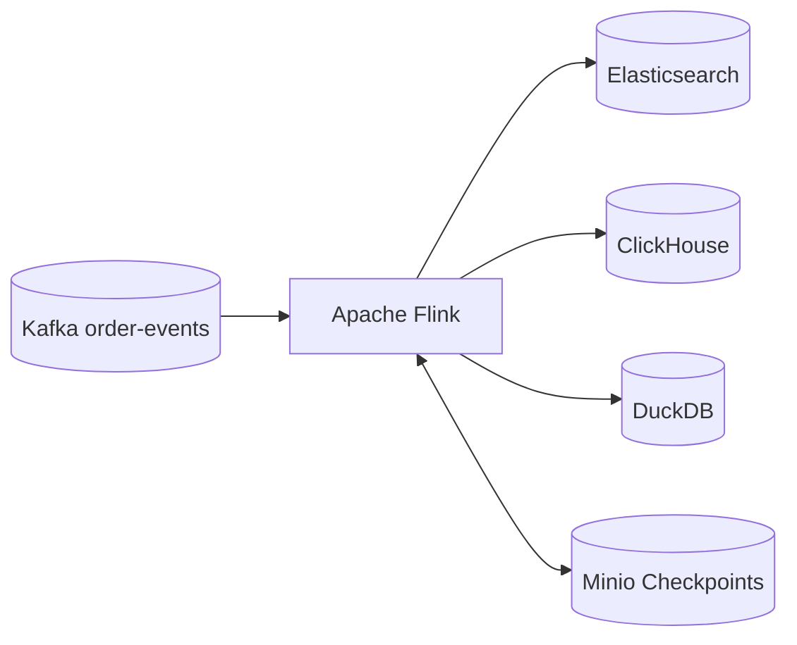

# Real-time Analytics Pipeline Guide

This document provides a detailed overview of the analytics pipeline, including its architecture, components, and troubleshooting steps.

## Architecture Overview

The analytics pipeline is built on **Apache Flink**, which provides high-throughput, low-latency stream processing with exactly-once semantic guarantees.



### Components

1.  **Source (Kafka)**: Consumes `order-events` from the messaging backbone.
2.  **State Backend (RocksDB)**: Manages incremental checkpoints and large state.
3.  **Checkpointing (Minio)**: Provides S3-compatible storage for Flink state survival.
4.  **Sinks**:
    -   **Elasticsearch (v7.17.10)**: Indices order data for real-time search.
    -   **ClickHouse**: Stores processed events for OLAP and BI.
    -   **DuckDB**: Localized feature store for ML pipelines.

## Monitoring Tools

### Flink UI
- **URL**: `http://localhost:8081`
- **Use Case**: Monitor job status, backpressure, and checkpointing health.

### Elasticvue
- **URL**: `http://localhost:8084`
- **Use Case**: Explore Elasticsearch indices (`order_analytics`), verify data insertion, and check cluster health.

## Troubleshooting

### Elasticsearch Connectivity (CORS)
If Elasticvue fails to connect with a "Failed to fetch" error, ensure CORS is enabled in `docker-compose.dev.yml`:
```yaml
environment:
  - http.cors.enabled=true
  - http.cors.allow-origin="*"
```

### Kafka Topic Missing
If the pipeline crashes with `UnknownTopicOrPartitionException`, ensure the topic exists:
```bash
docker exec -it kafka kafka-topics --create --topic order-events --bootstrap-server localhost:9094 --partitions 1 --replication-factor 1
```

### Null Pointer Exceptions
The pipeline includes a `WHERE order_id IS NOT NULL` filter to prevent crashes from incomplete Kafka records. If you see schema-related errors, verify the record format in Kafka UI (`:8080`).
