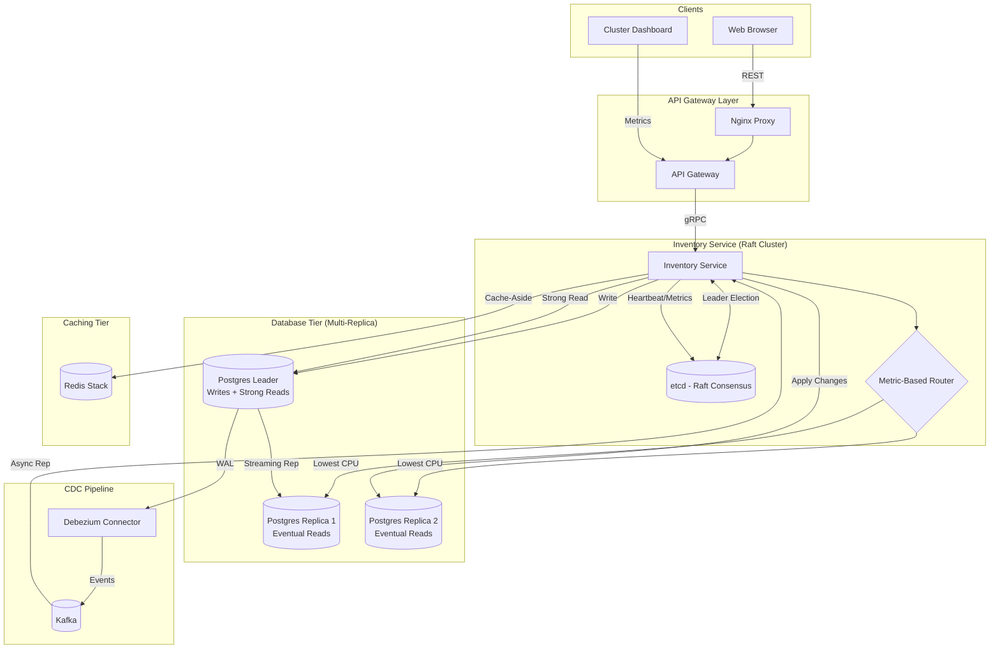

# Architecture Documentation

## Overview
This system is composed of multiple microservices communicating via gRPC, adhering to industry standard repository structures.

### Components

1.  **API Gateway (Python FastAPI)**:
    *   **Structure**: Uses the `src` layout with `pyproject.toml`.
    *   **Responsibility**: REST endpoints, authentication (planned), and gRPC client for internal services. Now includes a **Tier-1 Bloom Filter** for catalog existence pre-filtering.
    *   **Path**: `api-gateway/src/app/`
2.  **Order Service (Go)**:
    *   **Structure**: Follows Standard Go Layout (`cmd/`, `internal/`, `pkg/`).
    *   **Responsibility**: Order business logic and gRPC server.
    *   **Path**: `order-service/cmd/server/`
3.  **Inventory Service (Python FastAPI)**:
    *   **Structure**: Uses the `src` layout with `pyproject.toml`.
    *   **Responsibility**: Manages product stock, implements **Event-Driven Caching** and a **Tier-2 Cuckoo Filter**.
    *   **Path**: `inventory-service/src/app/`

## Repository Structure

```text
.
├── api-gateway/            # Python FastAPI Gateway
│   ├── src/                # Source code
│   │   ├── app/            # Application logic
│   │   └── generated/      # Generated gRPC code
│   ├── pyproject.toml      # Dependency management
│   └── Dockerfile          # Containerization
├── order-service/          # Go Order Service
│   ├── cmd/                # Entry points
│   ├── internal/           # Private code
│   ├── pkg/                # Public/Shared code (generated gRPC)
│   ├── go.mod              # Dependency management
│   └── Dockerfile          # Containerization
├── proto/                  # Protobuf definitions
├── docs/                   # Documentation
├── Makefile                # Automation (code gen, etc)
└── docker-compose.yml      # Orchestration
```



## Resilience & High Availability
The system now implements **Industry Standard High Availability**:
1.  **Raft Consensus**: Uses `etcd` for distributed leader election and cluster state management.
2.  **Multi-Replica Routing**: Metric-based routing (CPU, connections, health) ensures traffic is directed to the most optimal node.
3.  **Hybrid Replication**:
    *   **Native Streaming**: Replica 1 uses standard Postgres streaming replication.
    *   **Async CDC**: Replica 2 uses Kafka-based CDC (Debezium) for eventually consistent updates.

## Resilience Patterns

The **API Gateway** implements multiple resilience layers:
1.  **Rate Limiting**: Token Bucket algorithm with Redis for centralized limiting.
2.  **Load Shedding**: Automatic rejection of non-critical requests under high system stress.
3.  **Tier-1 Bloom Filter**: Prevents invalid catalog requests from hitting downstream services.

For more details, see [resilience.md](resilience.md).
