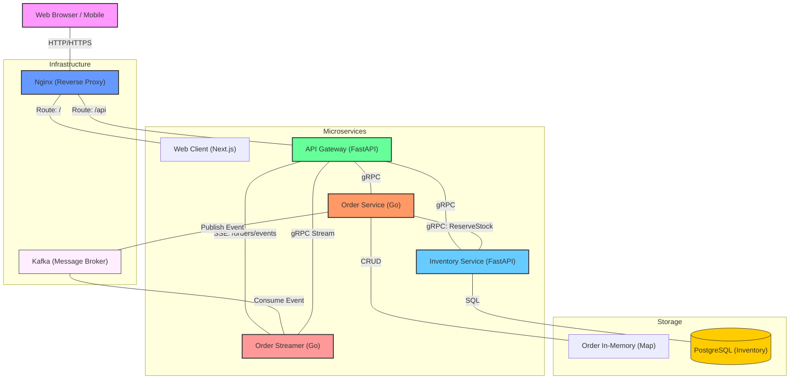

# System Architecture Diagram - Order Processing System

This document provides a detailed view of the current system architecture and outlines strategies for handling scale.

## Architecture Overview

The system follows a microservices architecture using **gRPC** for efficient internal communication, **FastAPI** as an API Gateway, and **Nginx** as a reverse proxy.

### Current Architecture (Mermaid)

---

## Component Details

1.  **Nginx Proxy**: Acts as the entry point.
2.  **Web Client (Next.js)**: Modern dashboard for managing orders and viewing stock.
3.  **API Gateway (FastAPI)**: Routes external REST requests to internal gRPC services.
4.  **Order Service (Go)**: Manages business logic and publishes order status events to Kafka.
5.  **Order Streamer (Go)**: Consumes Kafka events and provides a gRPC server-streaming endpoint.
6.  **Inventory Service (Python)**: Manages stock levels with ACID compliance via PostgreSQL.
7.  **Kafka Broker**: Asynchronous message backbone for decoupled event-driven updates.

---

## Scaling for Growth

- **Service Mesh**: Use Istio to manage gRPC traffic and retries.
- **Event-Driven Resilience**: Kafka ensures that status updates are delivered even if services are temporarily down.
- **Database Sharding**: As inventory grows, shard PostgreSQL by product category.
- **Caching**: Implement Redis in the Inventory Service for lightning-fast stock checks.
