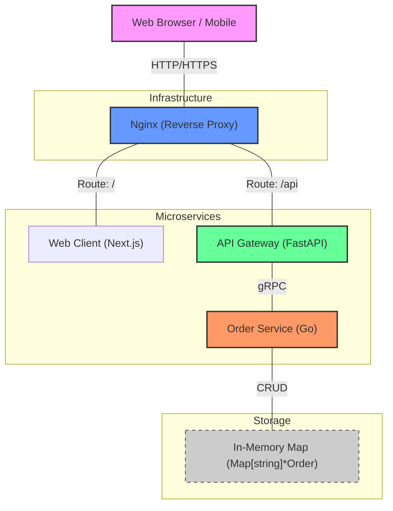

# System Architecture Diagram - Order Processing System

This document provides a detailed view of the current system architecture and outlines strategies for handling scale.

## Architecture Overview

The system follows a microservices architecture using **gRPC** for efficient internal communication, **FastAPI** as an API Gateway, and **Nginx** as a reverse proxy.

### Current Architecture (Mermaid)



---

## Component Details

1.  **Nginx Proxy**: Acts as the entry point. It handles SSL termination (potential), load balancing, and routing requests based on path (`/api` vs `/`).
2.  **Web Client (Next.js)**: Server-side rendered frontend that provides the user interface for managing orders.
3.  **API Gateway (FastAPI)**: Translates RESTful JSON requests from the frontend into gRPC calls for the backend services. This provides a clean interface for external consumers.
4.  **Order Service (Go)**: A high-performance gRPC service written in Go. It encapsulates the core business logic for order creation and management.
5.  **gRPC Communication**: Uses Protocol Buffers (proto3) for schema-based, efficient binary serialization, which is significantly faster and smaller than JSON.

---

## Scaling for Growth

To handle massive scale (millions of orders), the following enhancements are recommended:

### 1. Persistent Storage (Database)
Currently, data is stored in memory. For scale, migrate to:
- **Relational (PostgreSQL)**: For ACID compliance and complex queries.
- **NoSQL (MongoDB/DynamoDB)**: If the order schema is highly dynamic.
- **Sharding**: Horizontal partitioning of data across multiple database instances.

### 2. Message Queue (Async Processing)
Introduce a message broker (**Kafka** or **RabbitMQ**) between the API Gateway and Order Service:
- **Decoupling**: API Gateway returns "Accepted" immediately.
- **Worker Scaling**: Spin up multiple instances of the Order Service to process the queue.

### 3. Caching Layer
Use **Redis** to cache frequently accessed data (e.g., active orders, product catalogs) to reduce load on the primary database.

### 4. Load Balancing & Service Discovery
- Use **Kubernetes (K8s)** for orchestration.
- Implement **Envoy Proxy** or **Istio** for advanced service-to-service communication, retries, and circuit breaking.

---

## Eraser DSL (For Eraser.io Editor)

If you have an Eraser API key, you can use the code below in the [Eraser Editor](https://app.eraser.io/).

```eraser
// Cloud Architecture Diagram
diagramType: "cloud-architecture-diagram"

elements: [
  {
    type: "group"
    label: "Public Cloud"
    children: [
      {
        type: "node"
        label: "User Device"
        icon: "user"
      }
      {
        type: "group"
        label: "VPC"
        children: [
          {
            type: "node"
            label: "Nginx Proxy"
            icon: "nginx"
          }
           {
            type: "node"
            label: "Web Client (Next.js)"
          }
          {
            type: "node"
            label: "API Gateway (FastAPI)"
            icon: "python"
          }
          {
            type: "node"
            label: "Order Service (Go)"
            icon: "go"
          }
        ]
      }
    ]
  }
]

connections: [
  { from: "User Device", to: "Nginx Proxy", label: "HTTPS" }
  { from: "Nginx Proxy", to: "Web Client (Next.js)", label: "Static/SSR" }
  { from: "Nginx Proxy", to: "API Gateway (FastAPI)", label: "Proxy" }
  { from: "API Gateway (FastAPI)", to: "Order Service (Go)", label: "gRPC" }
]
```
