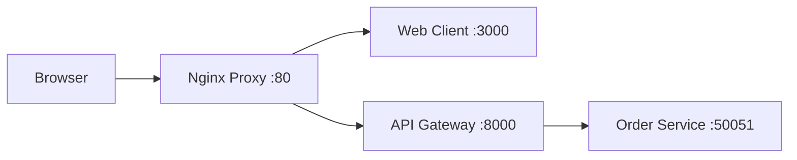

# Frontend Integration and Ingress Proxy

This document details the configuration and communication flow for the Order Processing System's user interface and its reverse proxy.

## Architecture



## Nginx Configuration

The Nginx proxy acts as the single entry point for the application.

- **Frontend**: All requests to `/` are routed to the Next.js application.
- **API**: All requests starting with `/api/` are stripped of the prefix and routed to the FastAPI gateway.
- **Security**: Basic headers are added to prevent clickjacking and sniffing.

## Web Client Features

Built with **Next.js 15**, **TypeScript**, and **Tailwind CSS**, the client provides:

1. **Order Dashboard**: A summary of order activity and a table for tracking recent orders.
2. **Interactive UI**: Leverages **Shadcn UI** for high-quality, accessible components.
3. **End-to-End Flow**: Communicates with the gRPC microservices via the FastAPI gateway.

## Running Locally

To start the entire stack including the proxy and client:

```bash
make up-dev
```

Access the UI at: [http://localhost](http://localhost)
Access the API directly via proxy: [http://localhost/api/](http://localhost/api/)
