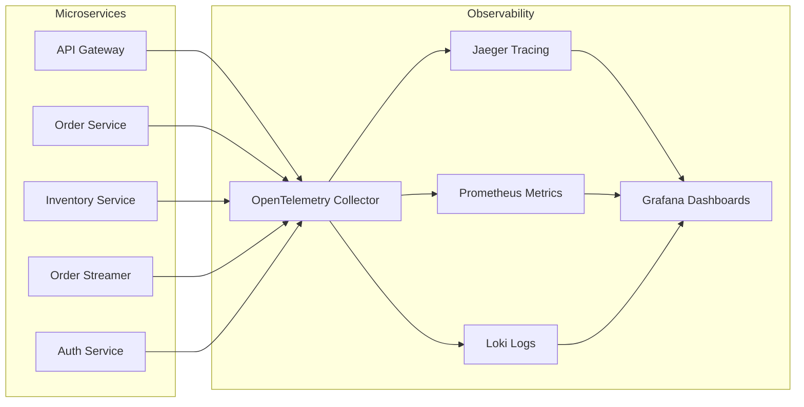

# Observability and Distributed Tracing

This document describes the observability stack integrated into the Order Processing System.

## Architecture

The system uses **OpenTelemetry (OTEL)** as the single source of truth for telemetry data (traces, metrics, and logs).



## Components

### OpenTelemetry Collector
The central hub for all telemetry data. It receives data via OTLP (gRPC and HTTP) and exports it to the respective backends.
- **Config**: `otel-collector-config.yaml`
- **Port**: 4317 (gRPC), 4318 (HTTP)

### Distributed Tracing (Jaeger)
Provides end-to-end visibility into requests as they flow through the microservices.
- **UI**: `http://localhost:16686`
- **Usage**: Search for services (e.g., `api-gateway`) to see traces.

### Metrics (Prometheus)
Collects performance metrics from all services.
- **UI**: `http://localhost:9090`
- **Config**: `prometheus.yaml`

### Centralized Logging (Loki)
Aggregates logs from all services, correlated with trace IDs for easier debugging.
- **UI**: Accessible via Grafana (Explore -> Loki)
- **Shortcut**: `make loki`

### Message Visibility (Kafka UI)
Provides a web interface to monitor Kafka topics, messages, and consumer groups.
- **UI**: `http://localhost:8080`
- **Shortcut**: `make kafka-ui`

### Workflow Visibility (Temporal UI)
Provides workflow-level history, retries, and compensation execution visibility for Temporal-routed sagas.
- **UI**: `http://localhost:8233`
- **Shortcut**: `make temporal-ui`

### Dashboards (Grafana)
The unified visualization layer for traces, metrics, and logs.
- **UI**: `http://localhost:3000`
- **Default Login**: admin / admin

## How to Run

1.  **Start the Stack**:
    ```bash
    docker-compose up -d
    ```
2.  **Generate Traffic**:
    Run the test script to create orders and trigger service interactions.
    ```bash
    ./test_flow.sh
    ```
3.  **View Traces**:
    Go to `http://localhost:16686` and look for traces from `api-gateway`.
4.  **Explore Metrics**:
    Go to `http://localhost:9090` and search for standard Go/Python/Process metrics.
5.  **View Consolidated Logs**:
    Go to `http://localhost:3000`, add Loki as a datasource (if not automatic), and use the Explore view.
